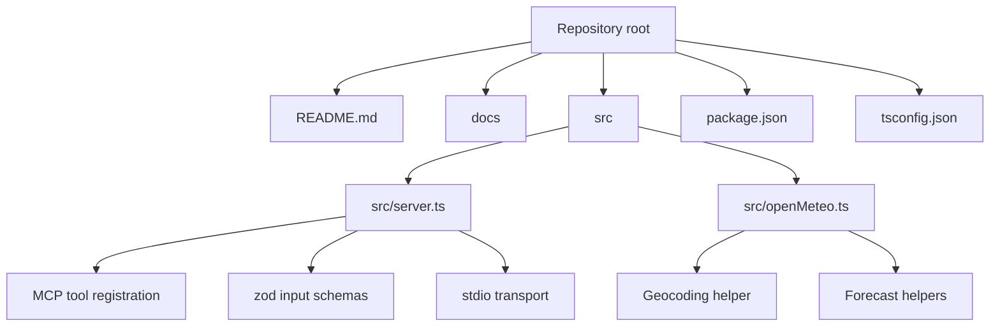
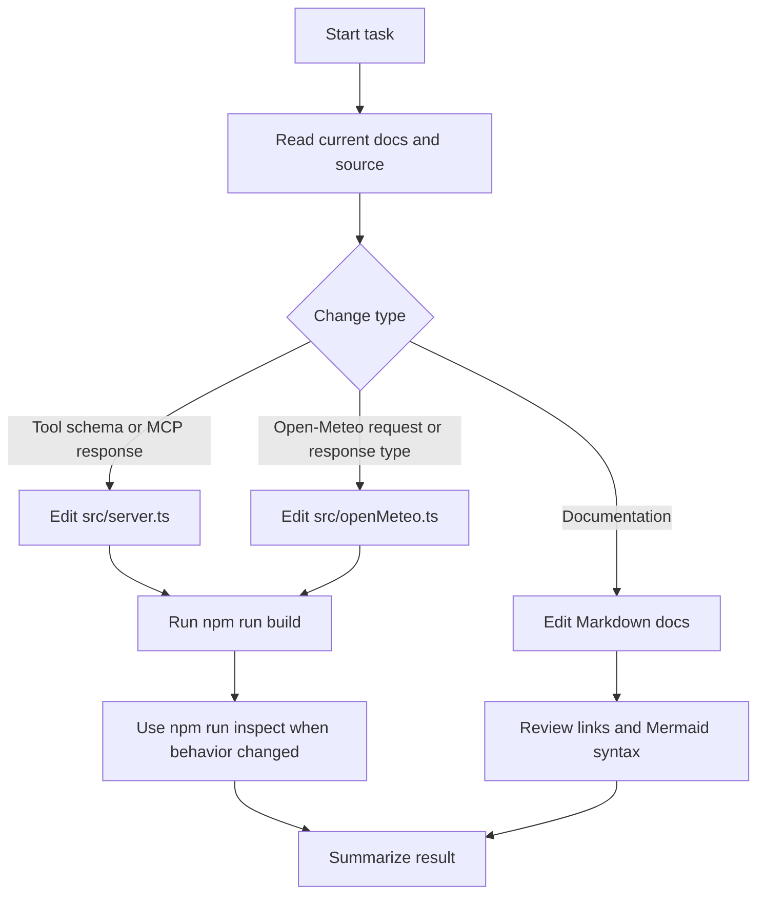
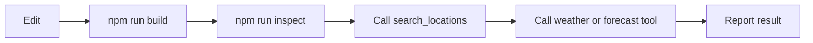

# AI Agent Guide

This repository contains a small TypeScript MCP server that exposes Open-Meteo weather tools over stdio. Use this file as the first stop when an AI coding agent needs to modify, test, or document the project.

## Project Map

## Fast Start

1. Read [README.md](README.md) and the files in [docs](docs).
2. Install dependencies with `npm install` if `node_modules` is missing.
3. Run `npm run build` before considering code changes complete.
4. Use `npm run inspect` when you need to test the MCP tools manually.

## Common Commands

| Task | Command |
| --- | --- |
| Install dependencies | `npm install` |
| Run the server in development | `npm run dev` |
| Build TypeScript | `npm run build` |
| Start compiled server | `npm start` |
| Open MCP Inspector | `npm run inspect` |

## Change Workflow

## Coding Conventions

- Keep MCP tool registration in [src/server.ts](src/server.ts).
- Keep Open-Meteo HTTP details and response types in [src/openMeteo.ts](src/openMeteo.ts).
- Validate public tool inputs with `zod` in the MCP tool schema.
- Return concise JSON text from tool handlers.
- Do not add API keys or secrets. Open-Meteo endpoints used here are public and keyless.
- Avoid writing normal logs to stdout because stdio is used for MCP protocol messages. If diagnostics are needed, use stderr.
- Do not edit generated `dist` files by hand.

## Tool Ownership

| MCP tool | Primary file | API helper |
| --- | --- | --- |
| `search_locations` | [src/server.ts](src/server.ts) | `searchLocations` in [src/openMeteo.ts](src/openMeteo.ts) |
| `get_current_weather` | [src/server.ts](src/server.ts) | `getCurrentWeather` in [src/openMeteo.ts](src/openMeteo.ts) |
| `get_daily_forecast` | [src/server.ts](src/server.ts) | `getDailyForecast` in [src/openMeteo.ts](src/openMeteo.ts) |

## Verification Path

For docs-only changes, at minimum check that Markdown links point to existing files and Mermaid blocks use `flowchart`, `sequenceDiagram`, or another supported Mermaid diagram type.

