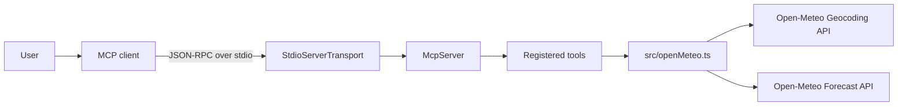
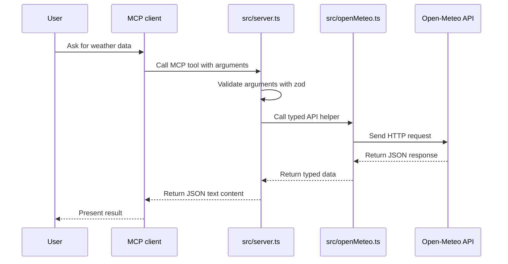
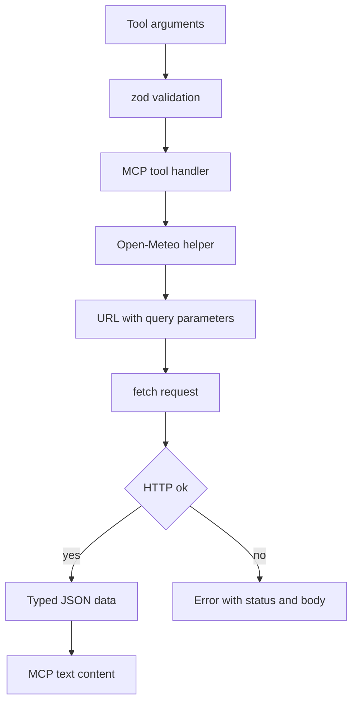

# Architecture

The server is a TypeScript MCP server that runs on Node.js, communicates with MCP clients over stdio, validates tool inputs with `zod`, and calls Open-Meteo public HTTP APIs through a small client module.

## Runtime Overview

## Module Responsibilities

| File | Responsibility |
| --- | --- |
| [../src/server.ts](../src/server.ts) | Creates the MCP server, registers tools, defines `zod` input schemas, calls API helpers, and returns MCP content. |
| [../src/openMeteo.ts](../src/openMeteo.ts) | Owns Open-Meteo endpoint URLs, response types, URL query construction, fetch execution, and HTTP error handling. |
| [../package.json](../package.json) | Defines scripts for development, build, production start, and MCP Inspector. |
| [../tsconfig.json](../tsconfig.json) | Configures strict TypeScript compilation for NodeNext modules. |

## Tool Call Sequence

## Data Flow

## External Services

| Service | Base URL | Used by |
| --- | --- | --- |
| Open-Meteo Geocoding | `https://geocoding-api.open-meteo.com/v1` | `search_locations` |
| Open-Meteo Forecast | `https://api.open-meteo.com/v1` | `get_current_weather`, `get_daily_forecast` |

No API key is required for the current integration.

## Design Notes

- The server uses stdio, so stdout belongs to MCP protocol traffic.
- Tool inputs are checked before any upstream HTTP request is made.
- Open-Meteo HTTP errors are surfaced as thrown errors containing status, status text, and response body.
- Response data is returned as formatted JSON text so a model or inspector can read it directly.

