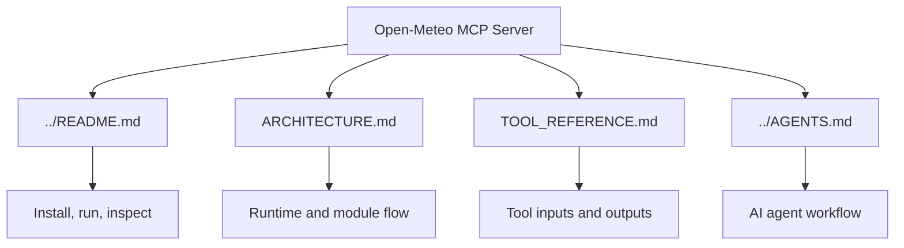

# Documentation

This directory explains how the Open-Meteo MCP server is structured, how its tools map to the upstream API, and how future AI agents should work with the project.

## Files

| File | Purpose |
| --- | --- |
| [../README.md](../README.md) | User-facing setup, run commands, and basic MCP client config. |
| [ARCHITECTURE.md](ARCHITECTURE.md) | Runtime architecture, module responsibilities, and request flow diagrams. |
| [TOOL_REFERENCE.md](TOOL_REFERENCE.md) | MCP tool catalog, validation rules, examples, and extension notes. |
| [../AGENTS.md](../AGENTS.md) | Practical instructions for AI agents editing this repository. |

## Reading Order

1. Start with [../README.md](../README.md) for setup and usage.
2. Read [ARCHITECTURE.md](ARCHITECTURE.md) before changing code.
3. Use [TOOL_REFERENCE.md](TOOL_REFERENCE.md) when adding, testing, or calling tools.
4. Use [../AGENTS.md](../AGENTS.md) as the operating guide for AI-assisted maintenance.

