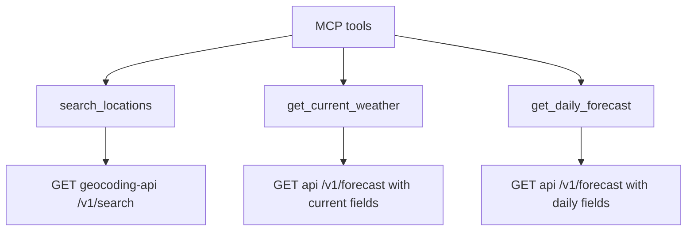
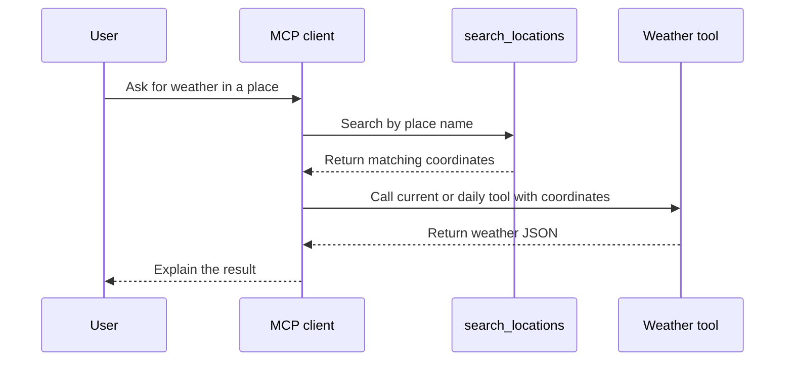
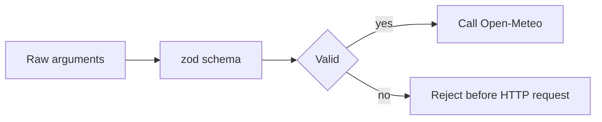

# Tool Reference

This server exposes three MCP tools. They wrap Open-Meteo public endpoints and require no API key.

## Tool Map



## `search_locations`

Searches for locations by city or place name.

| Field | Type | Validation | Default | Description |
| --- | --- | --- | --- | --- |
| `name` | string | Minimum length `1` | None | City or place name. |
| `count` | number | Integer from `1` to `10` | `5` | Maximum number of matches to return. |

Example input:

```json
{
  "name": "Bengaluru",
  "count": 3
}
```

Example output shape:

```json
{
  "locations": [
    {
      "id": 1277333,
      "name": "Bengaluru",
      "latitude": 12.97194,
      "longitude": 77.59369,
      "country": "India",
      "timezone": "Asia/Kolkata"
    }
  ]
}
```

## `get_current_weather`

Gets current weather for a latitude and longitude.

| Field | Type | Validation | Default | Description |
| --- | --- | --- | --- | --- |
| `latitude` | number | `-90` to `90` | None | Latitude in decimal degrees. |
| `longitude` | number | `-180` to `180` | None | Longitude in decimal degrees. |

Example input:

```json
{
  "latitude": 12.97194,
  "longitude": 77.59369
}
```

Returned fields include current temperature, relative humidity, apparent temperature, precipitation, wind speed, wind direction, and units.

## `get_daily_forecast`

Gets a daily forecast for a latitude and longitude.

| Field | Type | Validation | Default | Description |
| --- | --- | --- | --- | --- |
| `latitude` | number | `-90` to `90` | None | Latitude in decimal degrees. |
| `longitude` | number | `-180` to `180` | None | Longitude in decimal degrees. |
| `days` | number | Integer from `1` to `16` | `7` | Number of forecast days to return. |

Example input:

```json
{
  "latitude": 12.97194,
  "longitude": 77.59369,
  "days": 5
}
```

Returned fields include forecast dates, daily maximum and minimum temperatures, maximum precipitation probability, maximum wind speed, and units.

## Recommended Client Flow



## Validation Summary



## Adding A New Tool

1. Add or update response types in [../src/openMeteo.ts](../src/openMeteo.ts).
2. Add a helper function that builds the upstream URL and calls `getJson`.
3. Register the MCP tool in [../src/server.ts](../src/server.ts).
4. Define all public inputs with `zod` validation.
5. Return concise JSON text content.
6. Run `npm run build`.
7. Use `npm run inspect` to call the new tool manually.

